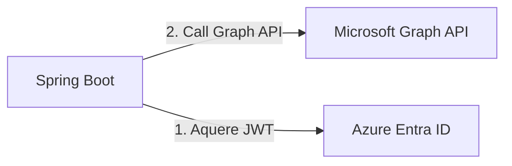

# Spring Boot & Azure Mail Sender

This is a simple Spring Boot PoC application that sends emails using Microsoft Graph API using `microsoft-graph` and
`azure-identity` libraries.



# Prerequisites

1. In Azure -> Azure Entra ID -> App registrations, create a new app registration.
2. In the app registration, go to "API permissions" and add the following permissions:
    - `Mail.Send`
3. In the app registration, go to "Certificates & secrets" and create a new client secret.
4. In Azure -> Azure Entra ID identify the sender user and use the `Object ID` as the `senderId` in the request body.
   Note: **The sender must have a valid mailbox and have any kind of Microsoft Business Licence**
4. In application.yml or application.properties, set the following properties:
    - `microsoft.azure.client-id`: The client ID of the app registration.
    - `microsoft.azure.client-secret`: The client secret value of the app registration.
    - `microsoft.azure.tenant-id`: The tenant ID of the app registration.
    - `microsoft.azure.scope`: The scope for the Microsoft Graph API. This should be set to
      `https://graph.microsoft.com/.default`.

# Build and Run

1. Clone the repository.
2. Open a terminal and navigate to the project directory.
3. Run the following command to build the project:
   ```bash
   ./mvnw clean install
   ```
4. Run the following command to start the application:
   ```bash
    ./mvnw spring-boot:run
    ```
5. Send a POST request to `http://localhost:8080/send-email` with the following JSON body:

```json
{
  "senderId": "...",
  "recipientList": "...",
  "subject": "...",
  "body": "..."
}
```

